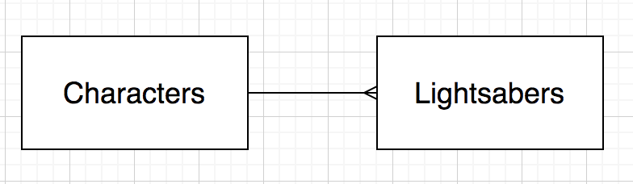

# One to Many Lab

## Learning Objectives

- Know how to model a one-to-many relationship
- Know how to create a one-to-many relationship in PostgreSQL
- Be able to select data from a one-to-many relationship

## Diagrams

When we design relationships for databases we often create a diagram before writing any code. 

For a one-to-many relationship we would use the following notation:

The connector in a one-to-many is also known as a `crow's foot`. We're saying **One character can have many lightsabers. One lightsaber belongs to only one character.**

## Task

- Create one database for your tables (`createdb one_to_many_lab`)

- Draw a diagram of the relationship
- Write an SQL script to implement the tables in PostgreSQL
- You should make reasonable decisions about the columns involved and what constraints they have 
- Insert some data into your tables

## 1. Movies & Directors

- Select all the Movies for a particular Director

## 2. Bank Accounts & Account Types & Customers

- You will need 3 tables for this task
- A Bank Account can be either "Current" or "Savings"
- A Bank Account has a foreign key to an `account_type` table
- A Bank Account can have one Customer
- Select all the Bank Accounts for a particular Customer

## 3. Think of your own one-to-many relationship and implement it using SQL